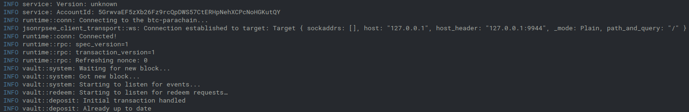

# Testing the vault client

The second important block of our testing scenario are the _**vaults**_. These take care of fetching information from Stellar and reporting it to the _testchain_, as well as reacting to certain events on the _testchain_ and forwarding them to Stellar.

Then run the following command and replace `<vault-secret>` with the secret key:

```bash
cd clients
cargo run --bin vault --features standalone-metadata  -- --keyring alice --stellar-vault-secret-key-filepath <secret_key_file_path> --stellar-overlay-config-filepath <cfg_file_path>

# You can use, from the provided examples
cargo run --bin vault --features standalone-metadata -- --keyring alice --stellar-vault-secret-key-filepath ./spacewalk/clients/stellar-relay-lib/resources/secretkey/stellar_secretkey_testnet --stellar-overlay-config-filepath ./spacewalk/clients/stellar-relay-lib/resources/config/testnet/stellar_relay_config_sdftest1.json
```

Wait until it finishes building, and ignore any warnings. If it builds and runs successfully, you should see logs like this:



<figure><figcaption><p>Once your vault is up and running your terminal should look like this</p></figcaption></figure>

At this point, you have the main blocks up and running, and you're ready to bridge some assets.

### Testing

We provide some ready-to-use configurations in our GitHub repository, you can play around with the various configurations [here](https://github.com/pendulum-chain/spacewalk/tree/main/clients/vault/resources/config)
