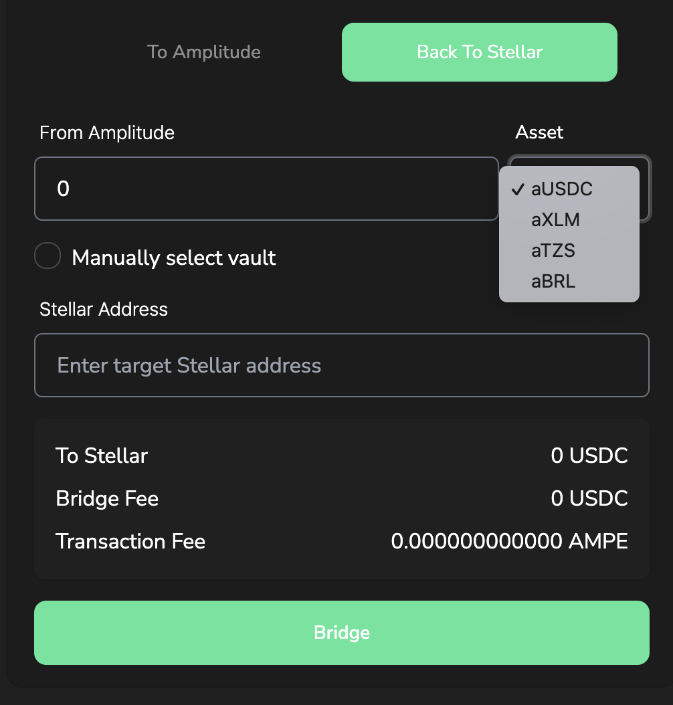

# PEN Tokenomics

PEN will be the native token of Pendulum. PEN utilities include powering transactions as the gas token on Pendulum as well as governance and staking.&#x20;

**Tokenomics Overview**

Ticker: PEN

Relay Chain: Polkadot

Supply Structure: Inflationary

Total Supply: 200,000,000

Initial Circulating Supply: 15,200,000

Supply at Genesis: 160,000,000

**Distribution**\
****The distribution maintains a balance between Pendulum’s early supporters and the Pendulum community with an even 50/50 split.

****.png>)****

**Community Distribution**\
****The chart below shows the percentage that each community bucket takes up from the community bucket that takes up 50% of the total PEN total allocation. The community distribution includes staking rewards for directly staking PEN (28%) as well as staking rewards related to Spacewalk bridge (12%). The Polkadot crowdloan [waitlist is now open](https://medium.com/pendulum-chain/claim-your-pendulum-polkadot-crowdloan-waitlist-spot-now-e2df97ff06a9) where you can earn bonus rewards for signing up early. Note that the crowdloan reserve allocates tokens to support funding of future parachain slots

**Backers Distribution**\
****The below chart shows the distribution of tokens to Pendulum’s early backers that have supported the building of Pendulum and Amplitude for over 1 year now.

.png>)

_Note: The percentages in the Community and Backers charts should be halved to find the percentage of the overall tokenomics. For example, Staking Rewards is 14% of the overall tokenomics and 28% of the Community bucket._

**Vesting Schedule**\
****Below is the vesting schedule for all community and backer tokens. Most of the tokens include a vesting schedule that unlocks linearly over 2 to 3 years to ensure all participants are incentivized to work towards Pendulum’s long-term growth.

****

**Crowdloan PEN Token Details**\
****The vesting schedule for crowdloan participants is 10% unlocked at TGE and the remaining 90% vested linearly over 96 weeks (Polkadot parachain lease period). Remember that when redeeming your DOT, your DOT will be unlocked and returned to you without any input required. Full details:

**Eligibility**

* Participants must have a Polkadot account
* Participants must hold a minimum of 5 DOT in their accounts
* Users must agree to Pendulum’s Terms and Conditions. Note: No KYC is required

**How to participate**

* Contribute via our [website](https://pendulumchain.org/) once the crowdloan is live
* Lock up your DOT for the parachain lease period (96 weeks)

**Rewards**

* On your contribution
* 5% for signing up on the waitlist
* 5% for participating in the amplifier campaign
* 3% for contributors of the Amplitude Kusama crowdloan
* 15% bonus if your contribution is in the 100,000 DOT
* 10% if your contribution is in the 100,001–200,000 DOT
* 5% if your contribution is in 200,001–300,000 DOT
