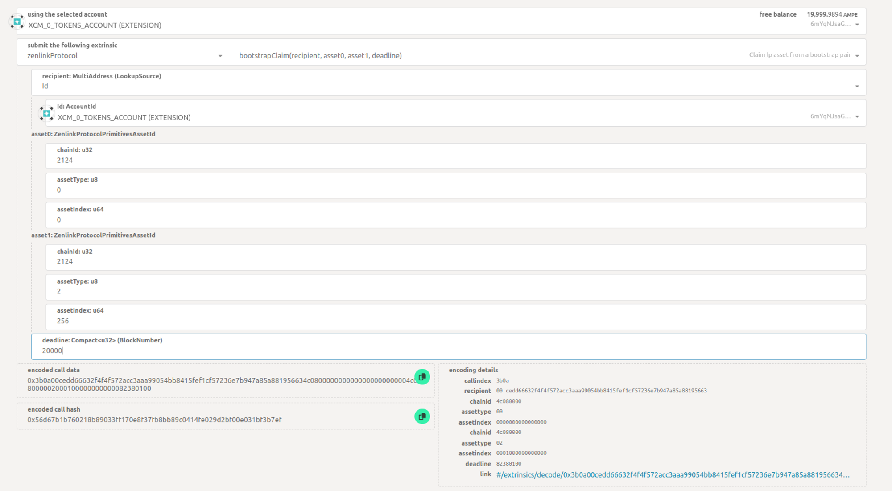

# LBP Guide

### How to move KSM from relay chain to Amplitude?

1. Go to [https://polkadot.js.org/apps/](https://polkadot.js.org/apps/) and switch to **Kusama** network from the network menu or directly click on this [link](https://polkadot.js.org/apps/?rpc=wss%3A%2F%2Fksm-rpc.stakeworld.io#/extrinsics/decode)
2. Find `Developer` in the top menu, and choose `Extrinsics` from the drop down. Select the `Decode` tab

<figure><figcaption>
Top tab
</figcaption></figure>

3. Paste this in the field `hex-encoded call 0x630201000100312101000101004e5d80a091a712b727ecbb00882bb28d4d64a6e7f6c87654b3243c489623f510010400000000070010a5d4e800000000`
4. Now switch to the `Submission` tab
5. In the `using the selected account` select the account you want to send the KSM from
6. Now in the beneficiary section in the `id` field, enter your address.

<figure><figcaption></figcaption></figure>

7. Now next in the assets section, enter the amount of KSM you want to transfer in the `Fungible` field. Note - Since there are 12 decimals for the KSM token, you need to add 12 zeros after choosing the KSM amount e.g. If you want to transfer 1 KSM, then you should write `1000000000000`.

<figure><figcaption></figcaption></figure>

8. Apart from this, you don’t need to change anything in the submission.
9. Now click on the “Submit Transaction” at the bottom of the screen.
10. Now from the pop-up click “Sign and Submit”. Next, enter your password in the wallet pop-up and confirm the transaction.
11. Once done, if the contribution is successful on polkadot.js screen you will see a green confirmation in the top right corner.

###

### How to contribute to the AMPE/KSM LBP?

**Note → You would need some AMPE tokens as gas for executing this extrinsic**

1. Go to [https://polkadot.js.org/apps/](https://polkadot.js.org/apps/) and switch to Amplitude network from the network menu or directly click on this [link](https://polkadot.js.org/apps/?rpc=wss%3A%2F%2Famplitude-rpc.dwellir.com#/explorer).
2. Find `Developer` in the top menu, and choose `Extrinsics` from the drop down
3. You will be on the following page, see screenshot below.

<figure><figcaption>
extrinsic screen example
</figcaption></figure>

4. Now choose the account you want to contribute from from the field “**using the selected account”**
5. Next in the “**Submit the following extrinsic**” dropdown choose “**`zenlinkProtocol`**”
6. In the next dropdown choose “**`bootstrapContribute(asset0, asset1, amount0Contribute, amount1Contribute, deadline)`**”
7. Now a list of fields would appear below.
8. In the asset0 section → This is for the AMPE token
   1. `chainId` should be 2124
   2. `assetType` should be 0
   3. `assetIndex` should be 0
9. In the `asset1` section → This is for the KSM token
   1. `chainId` should be 2124
   2. `assetType` should be 2
   3. `assetIndex` should be 256
10. In `amount0Contribute`, enter the amount you want to contribute for AMPE. Make sure to add `12` zeros to your amount. For ex. if you wish to contribute `10` then the input should be `10000000000000`
11. In `amount1Contribute`, enter the amount you want to contribute for KSM. Make sure to add `12` zeros to your amount. For ex. if you wish to contribute `10` then the input should be `10000000000000`
12. For `deadline` field, add the block number that is 5-10 blocks higher than the current block-number. For ex. current block number is 2,400,994 then add 5 so the input should be 2,400,999. Current blocknumber can be found in the top menu **Network > Explorer**
13. Now click on the “Submit Transaction” at the bottom of the screen.
14. Now from the pop-up click “Sign and Submit”. Next, enter your password in the wallet pop-up and confirm the transaction.
15. Once done, if the contribution is successful on polkadot.js screen you will see a green confirmation in the top right corner.

### How to claim the LP tokens?

Note: This is to be done once the LBP contribution period ends.

1. Follow steps 1,2 and 3 from this section [How to contribute to the AMPE/KSM LBP?](https://pendulum.gitbook.io/pendulum-docs/community/lbp-guide#how-to-contribute-to-the-ampe-ksm-lbp)
2. Now choose the account you want to sign this transaction from the field “**using the selected account”**

<figure><figcaption>
bootstrapClaim extrinsic
</figcaption></figure>

3. Next in the “**Submit the following extrinsic**” dropdown choose “**`zenlinkProtocol`**”
4. In the next dropdown choose “`**bootstrapClaim(recipient, asset0, asset1, deadline)**`”
5. Now a list of fields would appear below.
6. In the `recipient` dropdown select “Id”
7. Now in the AccounId dropdown select the account you used for contributing to the LBP
8. In the `asset0` section → This is for the AMPE token
   1. `chainId` should be 2124
   2. `assetType` should be 0
   3. `assetIndex` should be 0
9. In the `asset1` section → This is for the KSM token
   1. `chainId` should be 2124
   2. `assetType` should be 2
   3. `assetIndex` should be 256
10. For `deadline` field, add the block number that is 5-10 blocks higher than the current block-number. For ex. current block number is 2,400,994 then add 5 so the input should be 2,400,999. Current blocknumber can be found in the top menu **Network > Explorer**
11. Now click on “Submit Transaction” from the bottom of the screen.
12. Now from the pop-up click “Sign and Submit”. Next enter your password in the wallet pop-up and confirm the transaction.
13. Once done, if the contribution is successful on polkadot.js screen you will see a green confirmation in the top right corner.
