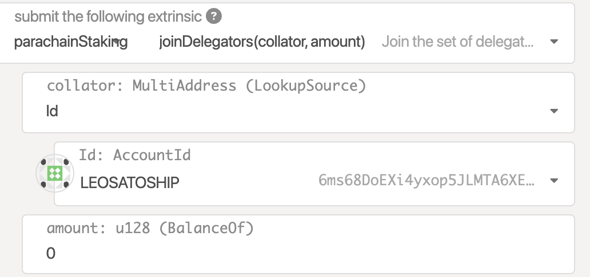
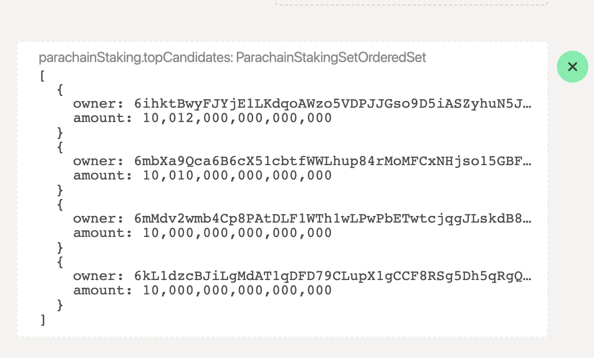
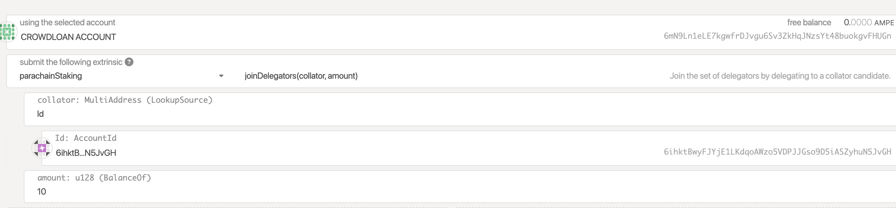
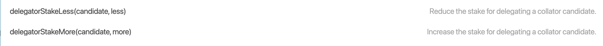
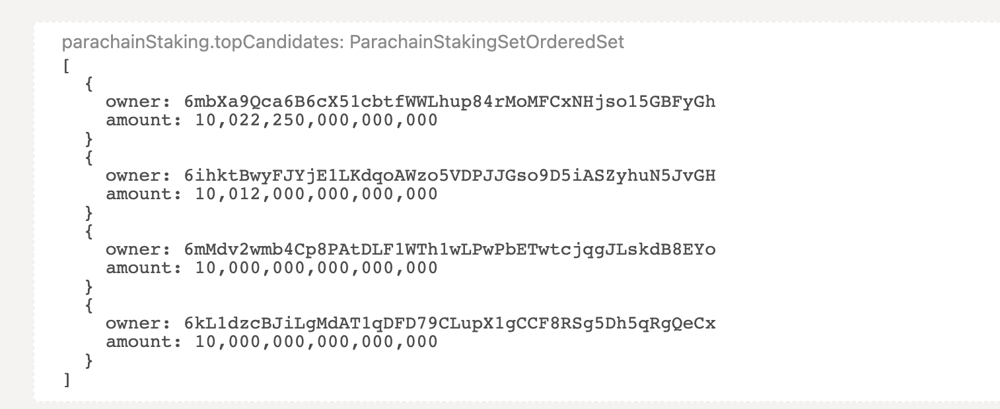

# Collator Delegation

| Network   | Min. delegator stake | URL            |
| --------- | -------------------- | -------------- |
| Pendulum  | 10 PEN               | \[coming soon] |
| Amplitude | 10 AMPE              | \[coming soon] |

Token holders on Pendulum and Amplitude can stake their tokens with the network collators to participate in the security of the network and in turn, get rewarded.

## How to delegate

While there will be a dedicated dashboard for staking, in the meantime users can perform the following actions via Polkadot.js in relation to staking.

In order to stake with a collator, first navigate to `Developer > Extrinsics` and then pick `parachainStaking` from list of extrinsics.

### Delegating - Join delegators action

In order to join as a delegator a user has to:

1. select the `parachainStaking` extrinsic
2. select the `joinDelegator` action
3. Lookup a collator address in order to find them

<figure><figcaption></figcaption></figure>

To find the collators a user can either:

* Be provided a list of collators
* Look up a list of collators:

1. Navigate to the tab chainstate under Developers/Chainstate
2. There query for: parachainStaking and select the topCandidates() function
3. Select an owner-id as a collator to delegate to

<figure><figcaption></figcaption></figure>

```bash
Do note that due to the current UI implementation staking X 
amount requires the addition of 12 0s 
Staking 10 → 10 0000 0000 0000
```

A user can appropriately delegate by filling the previous form with one or more of these ids

<figure><figcaption></figcaption></figure>

The transaction can now be submitted to perform the join delegators action

A user can see a list of their delegations under

1. Navigate to the tab chainstate under Developers/Chainstate
2. There query for: parachainStaking and select the delegatorState() action

### Claiming rewards

The respective method for checking a User’s rewards are under the ChainState tab

1. Navigate to the tab chainstate
2. Query parachainStaking and select the rewards() action

<figure><figcaption></figcaption></figure>

Collator rewards can be claimed by:

1. Navigating to extrinsics tab
2. Query parachainStaking and select the increment\_collator\_rewards action
3. Query parachainStaking and select the claimRewards action

Delegator rewards can be claimed by:

1. Navigating to extrinsics tab
2. Query parachainStaking and select the increment\_delegator\_rewards action
3. Query parachainStaking and select the claimRewards action

### Increasing and decreasing stakes

1. Navigate to the extrinsics tab and select the respective action
2. Insert the delegator-id to which a user has already delegated and the amount to change

<figure><figcaption></figcaption></figure>

The new stake will be PreviousStake **± amount**

### Leaving delegator

1. Navigate to the extrinsics tab
2. select the leaveDelegators() action
3. A user can verify the successful completion of the action thorugh:
   1.  The upper right success operation providing feedback\


       <figure><figcaption></figcaption></figure>
   2. By verifying via the topCandidates action that their stake has been removed from the collator
4. Before you can unlock your previously staked tokens, you have to wait 7 days (in block time).
   1. Navigate to the extrinsics tab
   2. Select the appropriate extrinsic: `parachainStaking -> unlockUnstaked(target)`
   3. Select the `Id` option (the _MultiAddress field_)
   4. Select the AMPE address you delegated from (_Id: AccountId_ field)
   5. Sign and submit the extrinsic (_Submit Transaction_ button)

Before:&#x20;

<figure><figcaption></figcaption></figure>

After:&#x20;

<figure><figcaption></figcaption></figure>
