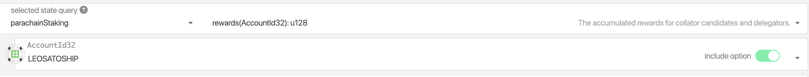
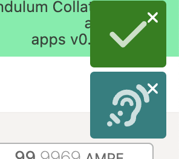

# Rewards

## Claiming rewards

The respective method for checking a User’s rewards are under the ChainState tab

1. Navigate to the tab `Developer` > `Chainstate`
2. Query `parachainStaking` and select the `rewards()`action

<figure><figcaption></figcaption></figure>


Conversely to Chainstate operations, Extrinsics only report Success or failure at the top right of the screen:&#x20;



Collator rewards can be claimed by:

1. Navigating to `Developer` > `Extrinsics` tab
2. Query `parachainStaking` and select the `incrementCollatorRewards()` action
3. Query `parachainStaking` and select the `claimRewards()` action

Delegator rewards can be claimed by:

1. Navigating to extrinsics tab
2. Query `parachainStaking` and select the `incrementDelegatorRewards()` action
3. Query `parachainStaking` and select the `claimRewards()` action
