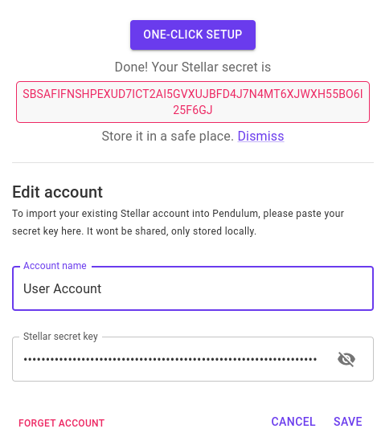

# Creating test accounts

In order to execute the entire example, we will need to create two different accounts on the Stellar testnet – we will refer to them as **User Account** and **`Vault Account`** for the rest of this tutorial. Additionally this tutorial will use a **Target Account** on _testchain_.

The User Account will be used to send funds from Stellar testnet to the Target Account on _testchain_, through the Vault Account. The latter account will lock the funds on Stellar while they are in use in _testchain_.


The assets we'll use in this example already exist on Stellar and are defined by an asset code and an asset issuer. The asset issuer's public key of both assets is

**`GAKNDFRRWA3RPWNLTI3G4EBSD3RGNZZOY5WKWYMQ6CQTG3KIEKPYWAYC`**

The the asset codes are **`EUR` ** and **`USDC`**.


#### Creating the User Account&#x20;

1. Go to [https://prototype.pendulumchain.org/](https://prototype.pendulumchain.org/)
2. In the top left-hand corner, click on the drop-down labeled ‘Rococo’ to open the Node selection menu.
3. Click on the select box and select “Custom node”. Change the input of “Custom Node Endpoint” to `ws://localhost:9944` and leave the “AMM Address” field as-is. Click on “Save”
4. Click on the “Connect Account” button in the top right corner and then click on “One-Click Setup”. This process will take some time and will create your User Account and Target Account and will fund them with some initial tokens for testing.
5. Wait until the process is finished and then save the shown Stellar secret key. You will need it in the next step.

#### Creating the Vault Account

1. Go to [https://prototype.pendulumchain.org/](https://prototype.pendulumchain.org/) and connect to your custom node `ws://localhost:9944` again
2. In the same user menu from the last step, click on the button "Forget account"
3. Click again on the "One click setup" to create a second account
4. Wait until the process is finished and then save the secret key as well.

**Note:** the reason we create the accounts this way is because it already funds the Vault Account so that it can be directly used for testing.&#x20;

#### Importing your accounts

1. Go to [https://prototype-ui.pendulumchain.org/?rpc=ws://127.0.0.1:9944#/accounts](https://prototype-ui.pendulumchain.org/?rpc=ws://127.0.0.1:9944#/accounts). This is a modified version of the polkadot.js explorer that supports importing accounts from a Stellar secret key and shows the `USDC` and `EUR` assets. Wait for the webapp to connect to your _testchain_
2. Click on the “Add account” button above the accounts list
3. Paste the Stellar secret key of your User Account into the text field
4. Click on the “I have saved my Stellar secret key safely” checkbox and proceed
5. Give the account a name (in our case User Account) and set a password
6. Click "Next" and then "Save"
7. Repeat steps 2-6 for the Vault Account


It is also recommended that you import your recently created accounts into a Stellar Wallet (such as [Solar](https://solarwallet.io/))

